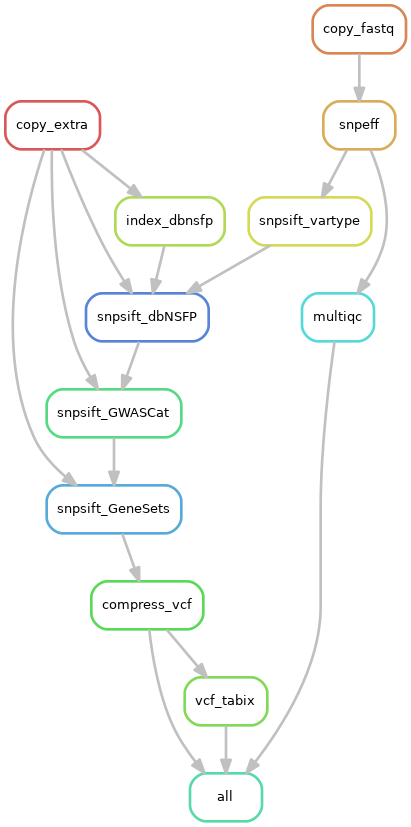

# Snakemake workflow: vcf-annotate-snpeff-snpsift

This is the [Snakemake](https://academic.oup.com/bioinformatics/article/28/19/2520/290322) workflow for VCF annotaion, powered by [SnpEff](https://embed.mystream.to/071ztp06vfty) and [SnpSift](http://snpeff.sourceforge.net/SnpSift.version_4_0.html) for annotation, using [dbSNFP](https://groups.google.com/forum/#!forum/dbnsfp_announcements), [MSigDb](http://software.broadinstitute.org/gsea/msigdb/) and [GWAS Catalog](https://www.ebi.ac.uk/gwas/) databases. VCF statistics are aggregated by [MultiQC](https://multiqc.info/).

Each tool and databases belong to their authors.

See [wiki] for more information.

# Rule graph

